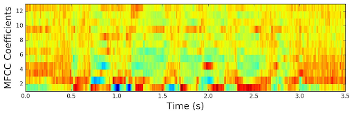
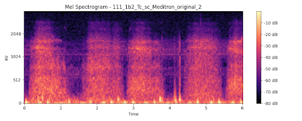
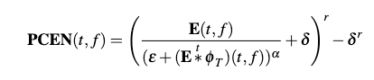
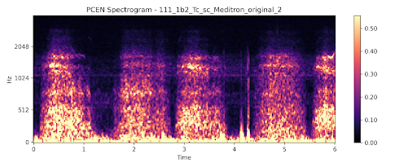
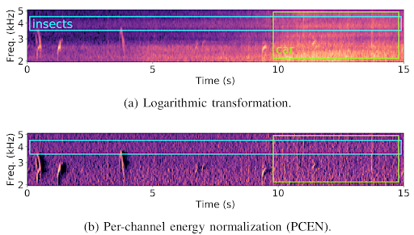

# Audio Preprocessing Techniques for Classifying Lung Sounds

## Overview  
This study investigates audio preprocessing methods for classifying lung sounds, focusing on **Per-Channel Energy Normalization (PCEN)**. Using two datasets, the study covers three classification tasks: disease diagnosis, distinguishing between normal and abnormal lung sounds, and identifying specific respiratory sounds (wheezes, crackles).

PCEN consistently outperformed traditional methods like Mel-Frequency Cepstral Coefficients (MFCC) and log-mel spectrograms, showing improved accuracy and robustness against noise.

## Preprocessing Methods Compared  
1. **MFCC**: A common method for extracting audio features but sensitive to noise, which limits its effectiveness in medical settings.  
   This is an MFCC image used in the study:

   

2. **Spectrograms**: Offer high accuracy but are also affected by ambient noise.  
   This is a lung sound spectrogram used in the study:

   

3. **PCEN**: Suppresses background noise and amplifies important lung sound patterns, making it ideal for this application.  
   This is the equation for PCEN:

   

   This is a PCEN spectrogram used in the study:

   

## Key Findings  
- PCEN outperforms MFCC and spectrograms across all datasets.  
- Critical parameters for PCEN performance include **smoothing coefficient (T)** and **root (r)** for dynamic range compression.  
- Data augmentation significantly improves classification accuracy, especially for PCEN.

## Applications  
- **Disease diagnosis**: Differentiates lung diseases such as COPD and pneumonia.  
- **Abnormal/Normal classification**: Effective for screening respiratory conditions.  
- **Wheezes/Crackles/Healthy classification**: Identifies specific lung sounds crucial for diagnosis.

## Conclusion  
PCEN proves to be a superior preprocessing method for automated lung sound diagnostics. Its adaptability, noise suppression, and robust performance make it a valuable tool for real-world medical applications.

This is a comparison between PCEN and mel-log-spectrogram:

## Future Work  
- Implementing automated parameter tuning for PCEN.  
- Exploring applications in other medical domains like heart or vocal sound analysis.  
- Integrating PCEN with wearable devices for real-time health monitoring.

For the full paper, [click here](./LungSoundsPaper.pdf).

For the Streamlit app, [click here](https://lung-classification-model.streamlit.app/).
